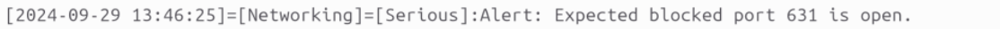
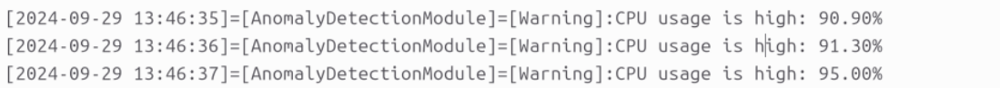

# COS40005-Intrusion-Detection-System

<!-- Improved compatibility of back to top link: See: https://github.com/othneildrew/Best-README-Template/pull/73 -->

<a name="readme-top"></a>

<!--
*** Thanks for checking out the Best-README-Template. If you have a suggestion
*** that would make this better, please fork the repo and create a pull request
*** or simply open an issue with the tag "enhancement".
*** Don't forget to give the project a star!
*** Thanks again! Now go create something AMAZING! :D
-->

<!-- PROJECT SHIELDS -->
<!--
*** I'm using markdown "reference style" links for readability.
*** Reference links are enclosed in brackets [ ] instead of parentheses ( ).
*** See the bottom of this document for the declaration of the reference variables
*** for contributors-url, forks-url, etc. This is an optional, concise syntax you may use.
*** https://www.markdownguide.org/basic-syntax/#reference-style-links
-->

[![Contributors][contributors-shield]][contributors-url]
[![Forks][forks-shield]][forks-url]
[![Stargazers][stars-shield]][stars-url]
[![Issues][issues-shield]][issues-url]
[![MIT License][license-shield]][license-url]
[![LinkedIn][linkedin-shield]][linkedin-url]

<!-- PROJECT LOGO -->
<br />
<div align="center">
  <a href="https://github.com/github_username/repo_name">
    
  </a>

<h3 align="center">Chromia Hostbased IDS</h3>

  <p align="center">
    A host-based intrusion detection system that can detect, monitor and alert on malicious activity or attacks on a linux-based webserver.
    <br />
    <a href="https://github.com/github_username/repo_name"><strong>Explore the docs »</strong></a>
    <br />
    <br />
    <a href="https://github.com/github_username/repo_name">View Demo</a>
    ·
    <a href="https://github.com/github_username/repo_name/issues">Report Bug</a>
    ·
    <a href="https://github.com/github_username/repo_name/issues">Request Feature</a>
  </p>
</div>

<!-- TABLE OF CONTENTS -->
<details>
  <summary>Table of Contents</summary>
  <ol>
    <li>
      <a href="#about-the-project">About The Project</a>
      <ul>
        <li><a href="#built-with">Built With</a></li>
      </ul>
    </li>
    <li>
      <a href="#getting-started">Getting Started</a>
      <ul>
        <li><a href="#prerequisites">Prerequisites</a></li>
        <li><a href="#installation">Installation</a></li>
      </ul>
    </li>
    <li><a href="#usage">Usage</a></li>
    <li><a href="#roadmap">Roadmap</a></li>
    <li><a href="#contributing">Contributing</a></li>
    <li><a href="#license">License</a></li>
    <li><a href="#contact">Contact</a></li>
    <li><a href="#acknowledgments">Acknowledgments</a></li>
  </ol>
</details>

<!-- ABOUT THE PROJECT -->

## About The Project

Students where asked by BadSecurity Inc to develop a Host Based Intrustion Detection System. We where tasked to do the reuqired reasurch and determine the best means of development.
Chromia was created by student attedning at Swinburne University as part of there final year project:
Students include:
<br>
[](https://github.com/brokenpip)
[](https://github.com/DoctorLock)
[](https://github.com/erikkvietelaitis)
[](https://github.com/samsharma12)
[](https://github.com/SimonPH2)
[](https://github.com/stackingheaps)

<p align="right">(<a href="#readme-top">back to top</a>)</p>

### Built With

- [](https://www.rust-lang.org/)
- [](https://www.gnu.org/software/bash/)

<p align="right">(<a href="#readme-top">back to top</a>)</p>

<!-- GETTING STARTED -->

## Getting Started

Chromia has a limited install distrubtion[^1] and has limited testing, please submit report bugs realted to the Guthub Repo for further assesment, but at this time development has no plans for expanding to other distros.

### Prerequisites

Users that want to try Chromia Host Based IDS will have to download via GitHub the install.sh script. This script will work to install all required dependences as well as create the required software.
This can be completed via downlaoding the script via:
Chromia will install 3rd party depndecies as part of the install process as so it can function this can include:

- git
- net-tools
- curl
- rust
- rust packages
- B3Sum

The install script will also have to create directries and severvice files for installation[^2]. as to ensure that the service runs to the best that we can provide.
<br>
<a href="https://raw.githubusercontent.com/erikkvietelaitis/COS40005-Intrusion-Detection-System/readme/install.sh" download="install.sh">

</a>
<br>
This will open a "raw" view of the install.sh script allowing you to audit it.
Once happy right click on the raw install.sh code and Save As.
Save the install.sh in any directory. We recommend the Downloads directory.

### Installation

Once the install script is saved and downloaded, in to the directory (Downloads)
Installation can be completed via changing to the directory where the install.sh script was saved to and then run:

```
chmod +x install.sh   #Making the script exacutable
sudo ./install.sh     #Installing the excutable script
```

In the installation process you maybe asked to install rust we recommend to selcet option 1 as this is the simplest install path that is known not to break the rust install process

You maybe prompted in the install process to enter your password, this is to build, start, and reload the systemd services[^2]. This promopt will occour 4 to 5 times and is a normal and expected. If you dont enter your passowrd it could cause the system to not install properlly or have complications in the installation process

#### AFTER INSTALLATION: IT IS IMPORTANT TO REFER TO THE CONFIG.INI FILE[^3]

Please refer to

```
/etc/config.ini
```

The config.ini has all relevent setting/ options for the function of Chromia

#### Logs and Understaing the Logs

The log file will be located at

```
/var/log/Chromia.log
```

This is the location of the outputed logs of the Chromia Host Based IDS. All the logs are collated together in to the single .log file.


Fig 1: Example of a Network related concern


Fig 2: Example of a general Ananomly realted concern
<br>
These examples provided, demonstrate what the log file printout should look like.
The normal operation of the log file, should include:
<br>
The current time and date, the associated "module" that detected the concern, an associated concen level, and a print out detailing the problem.

NOTES:
[^1]: Chromia has only been tested and currently designed for Ubuntu 24.04 LTS, it maybe possible to run on other Debian based systems, but your mileage may very.

[^2]: For Chromia to work we have to make two .service files as part of the install script. these are to help insure that Chromia remains active when closed as well as also restart after the Host device has been reset.
[^3]: Chromia may run and print logs but may not work properly as all files may not be properly configured
